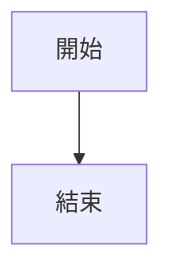

# Blogger Toolchain 使用手冊

> 本文件說明 `publishBot/blogger_toolchain.py` 的完整使用方式，涵蓋 YAML frontmatter、自訂 token 語法、以及 Blogger API 推送流程。

---

## 目錄

1. [環境需求](#環境需求)
2. [快速開始](#快速開始)
3. [YAML Frontmatter](#yaml-frontmatter)
4. [自訂 Token 語法](#自訂-token-語法)
   - [YouTube 嵌入](#youtube-嵌入)
   - [Mermaid 圖表](#mermaid-圖表)
   - [SMS 泡泡 — 基本用法](#sms-泡泡--基本用法)
   - [SMS 泡泡 — 可選參數](#sms-泡泡--可選參數)
   - [SMS Thread（對話群組）](#sms-thread對話群組)
   - [SMS Fold（折疊對話）](#sms-fold折疊對話)
5. [圖片自動 Lazy Loading](#圖片自動-lazy-loading)
6. [注意事項與常見問題](#注意事項與常見問題)

---

## 環境需求

| 項目 | 版本 / 說明 |
|---|---|
| Python | 3.10+ |
| 套件 | `markdown`, `PyYAML`, `python-dotenv`, `google-api-python-client`, `google-auth-oauthlib` |
| 環境變數 | 專案根目錄需有 `.env`，包含 `CLIENT_ID`、`CLIENT_SECRET`、`BLOG_ID` |
| 認證檔 | 首次執行會透過 OAuth2 產生 `token.pickle`，之後自動重複使用 |

**建議使用 venv：**

```bash
python3 -m venv venv
./venv/bin/pip install markdown PyYAML python-dotenv google-api-python-client google-auth-oauthlib
```

---

## 快速開始

```bash
# 使用 venv 執行
./venv/bin/python publishBot/blogger_toolchain.py path/to/your_post.md
```

腳本會依序執行：
1. 解析 YAML frontmatter（標題、標籤、文章 ID）
2. 展開所有自訂 token（Mermaid、YouTube、SMS 泡泡）
3. 將 Markdown 轉換為 HTML
4. 對圖片套用 Lazy Loading
5. 透過 Blogger API 推送文章

---

## YAML Frontmatter

每篇 Markdown 文章開頭必須以 `---` 包圍的 YAML 區塊定義文章屬性：

```yaml
---
title: 我的文章標題
labels: [技術, 筆記]
published: true
post_id: 1234567890123456789
---
```

| 欄位 | 必填 | 說明 |
|---|---|---|
| `title` | 建議填寫 | 文章標題，未填寫時預設為 `Untitled Request` |
| `labels` | 選填 | 文章標籤，以 YAML 陣列格式填寫 |
| `published` | 選填 | `true` = 直接發布；`false` 或未填寫 = 建立草稿 |
| `post_id` | 選填 | 已有文章的 ID，填寫後改為**更新模式**。首次發布後腳本會印出 ID，請回填 |

> [!IMPORTANT]
> 首次推送新文章後，請將 terminal 輸出的 `NEW POST ID` 回填至 frontmatter 的 `post_id` 欄位，後續更新才能正確覆蓋同一篇文章。

---

## 自訂 Token 語法

所有自訂 token 會在 `markdown.markdown()` 呼叫**之前**展開（pre-process 階段），因此不受 Markdown 本身語法影響。

### YouTube 嵌入

```markdown
{{youtube: dQw4w9WgXcQ}}
```

- 將 11 碼 YouTube 影片 ID 嵌入為 lazy-load 播放器。
- 輸出含有 `youtubelazy` class 的 `<div>` 結構。

---

### Mermaid 圖表

使用 fenced code block 搭配 `mermaid` 語言標記：

````markdown

````

- 輸出為 `<div class="mermaid">` 區塊，由前端 Mermaid.js 負責渲染。

---

### SMS 泡泡 — 基本用法

用於在文章中呈現類似手機簡訊的對話氣泡：

```markdown
{{sms-left: 你好，請問在嗎？}}
{{sms-right: 在的，請說}}
```

**輸出 HTML：**

```html
<div class="sms sms-left">
  <div class="sms-bubble"><p>你好，請問在嗎？</p></div>
</div>
<div class="sms sms-right">
  <div class="sms-bubble"><p>在的，請說</p></div>
</div>
```

**泡泡內支援 Markdown 語法：**

```markdown
{{sms-left: 這裡有 **粗體** 和 *斜體* 文字}}
{{sms-right: 請參考 [這個連結](https://example.com)}}
```

---

### SMS 泡泡 — 可選參數

使用 `|` 分隔符添加說話者名稱與時間戳：

```markdown
{{sms-left: 你好 | name=小明 | time=10:30}}
{{sms-right: 收到 | name=小美 | time=10:31}}
```

**輸出 HTML：**

```html
<div class="sms sms-left">
  <span class="sms-name">小明</span>
  <div class="sms-bubble"><p>你好</p></div>
  <span class="sms-time">10:30</span>
</div>
```

| 參數 | 必填 | 說明 |
|---|---|---|
| 訊息內容 | ✅ | `sms-left:` 或 `sms-right:` 後的第一段文字 |
| `name=` | ❌ | 顯示說話者姓名 |
| `time=` | ❌ | 顯示訊息時間戳 |

- `name` 與 `time` 可獨立使用，不需同時出現。
- 參數順序無限制。

---

### SMS Thread（對話群組）

將多個泡泡包裝在 `<div class="sms-thread">` 內，用於樣式分組：

```markdown
{{sms-thread-start}}
{{sms-left: 你好}}
{{sms-right: 嗨}}
{{sms-left: 吃飯了嗎？ | time=12:00}}
{{sms-thread-end}}
```

- `sms-thread` 是**選擇性包裝**，泡泡可以在 thread 外單獨使用。
- 若遺漏 `{{sms-thread-end}}`，腳本會輸出警告但不會中斷。

---

### SMS Fold（折疊對話）

將對話收進可展開/收合的 `<details>` 區塊：

```markdown
{{sms-fold-start: 點擊展開完整對話}}
{{sms-thread-start}}
{{sms-left: 第一句}}
{{sms-right: 第二句}}
{{sms-thread-end}}
{{sms-fold-end}}
```

- `sms-fold-start` 後的文字為 `<summary>` 顯示文字。
- 若未提供文字（`{{sms-fold-start}}`），預設為 `展開對話`。
- 支援與 `sms-thread` 巢狀使用。

---

## 圖片自動 Lazy Loading

所有標準 Markdown 圖片語法會在轉換後自動加上 lazy loading：

```markdown

```

**輸出：**

```html

```

不需額外操作，所有圖片自動處理。

---

## 注意事項與常見問題

> [!WARNING]
> **SMS token 不可放在同一行內與其他文字混用。** 每個泡泡 token 應獨立一行書寫，以確保 HTML 結構正確。

### Token 與 Code Block 的互動

在 fenced code block 或 inline code 內的 token **不會被展開**，會保留原始文字：

````markdown
這裡的 `{{sms-left: 不會被展開}}` 是安全的。

```markdown
{{sms-right: 這裡也不會被展開}}
```
````

### 錯誤處理原則

| 情境 | 行為 |
|---|---|
| `{{sms-left:}}` 空內容 | 輸出 Warning，跳過該 token，不產生破損 HTML |
| `{{sms-thread-start}}` 無對應 end | 輸出 Warning，HTML 不自動關閉（瀏覽器容錯） |
| `{{sms-fold-start}}` 無對應 end | 輸出 Warning，HTML 不自動關閉 |
| 任何格式錯誤 | **僅輸出 Warning，不中斷腳本**，其餘內容正常轉換與推送 |

### CSS 前置條件

SMS 泡泡的 CSS 樣式（`.sms-thread`、`.sms`、`.sms-left`、`.sms-right`、`.sms-bubble`、`.sms-name`、`.sms-time`、`.sms-fold`）必須已部署在 `Igniplex v3.1.xml` 的 `<b:skin>` 客製區塊中。腳本只負責產出 HTML，不處理樣式。

### 完整範例

```markdown
---
title: 與客服的對話紀錄
labels: [生活, 紀錄]
published: false
---

# 昨天的客服對話

以下是我與客服的完整對話：

{{sms-fold-start: 展開對話紀錄}}
{{sms-thread-start}}
{{sms-right: 你好，我想查詢訂單狀態 | name=我 | time=14:20}}
{{sms-left: 好的，請提供訂單編號 | name=客服 | time=14:21}}
{{sms-right: 訂單編號是 **A12345** | name=我 | time=14:22}}
{{sms-left: 您的訂單目前狀態為 *已出貨* | name=客服 | time=14:23}}
{{sms-thread-end}}
{{sms-fold-end}}

{{youtube: dQw4w9WgXcQ}}
```
