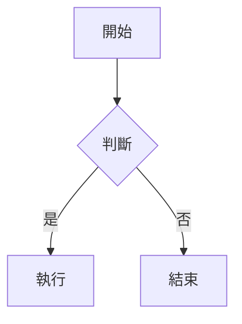

# blogger-toolchain (`publishBot`)

> 將本地 Markdown 文章透過 Blogger API v3 發布或更新至你的 Blogger 部落格。  
> 支援自訂 Token（YouTube 嵌入、SMS 對話泡泡、Mermaid 圖表）與圖片 Lazy Loading。

---

## 目錄

- [功能概覽](#功能概覽)
- [專案結構](#專案結構)
- [前置需求](#前置需求)
- [安裝說明](#安裝說明)
- [設定 `.env`](#設定-env)
- [Markdown 文章格式](#markdown-文章格式)
- [自訂 Token 語法](#自訂-token-語法)
- [使用方式](#使用方式)
- [首次 OAuth 授權](#首次-oauth-授權)
- [附屬工具：`convert_gif.sh`](#附屬工具convert_gifsh)
- [注意事項](#注意事項)

---

## 功能概覽

| 功能 | 說明 |
|---|---|
| 📝 Markdown → Blogger HTML | 解析 YAML Frontmatter，將 Markdown 轉換為 Blogger 可接受的 HTML |
| 🆕 新增文章 | 建立全新文章（草稿或直接發布） |
| ✏️ 更新文章 | 透過 `post_id` 識別並更新現有文章 |
| 🏷️ 標籤支援 | Frontmatter 中的 `labels` 自動同步至 Blogger 文章標籤 |
| 🎬 YouTube 嵌入 | `{{youtube: VIDEO_ID}}` Token 轉換為懶加載預覽圖 |
| 💬 SMS 對話泡泡 | `{{sms-left/right/thread/fold}}` Token 轉換為聊天氣泡 HTML |
| 📊 Mermaid 圖表 | ` ```mermaid ``` ` 程式碼區塊轉換為 `<div class="mermaid">` |
| 🖼 圖片 Lazy Loading | 所有 `` 自動加上 `data-src` 與透明佔位符 |
| 🔒 OAuth 2.0 | 與 `healthBot` 共用 `token.pickle`，只需授權一次 |

---

## 專案結構

```
publishBot/
├── blogger_toolchain.py  # 主程式（CLI 入口）
└── convert_gif.sh        # 附屬工具：GIF → WebM 格式轉換
```

相依的共用檔案（位於 repo 根目錄）：

```
BloggerTheme/            ← repo 根目錄
├── .env                 # 環境變數（CLIENT_ID / CLIENT_SECRET / BLOG_ID）
├── token.pickle         # OAuth token 快取（首次授權後自動產生）
└── venv/                # 虛擬環境（與 healthBot 共用）
```

---

## 前置需求

- Python **3.10+**
- `ffmpeg`（僅 `convert_gif.sh` 需要）
- Repo 根目錄存在有效的 **`.env`** 檔案（見下方說明）

---

## 安裝說明

本工具使用 repo 根目錄的共用虛擬環境（`venv/`），**不需要**在 `publishBot/` 下建立獨立 venv。

### 建立虛擬環境（首次）

```bash
# 從 repo 根目錄執行
python3 -m venv venv
```

### 安裝相依套件

```bash
# 從 repo 根目錄執行
./venv/bin/pip install markdown pyyaml python-dotenv \
    google-auth google-auth-oauthlib google-api-python-client
```

> **提示：** 若 repo 中已有 `healthBot/requirements.txt`，可先安裝 healthBot 的套件，
> 再手動補上 `markdown pyyaml` 即可，兩者大部分套件共用。

### 啟動虛擬環境（選用）

若你偏好進入 venv shell 互動操作：

```bash
# 啟動
source venv/bin/activate

# 確認 Python 來源
which python   # → .../BloggerTheme/venv/bin/python

# 離開
deactivate
```

> **注意：** 以下使用方式章節均以 `./venv/bin/python` 直接呼叫，  
> **不需要**先 `activate` 也可正常執行。

---

## 設定 `.env`

在 repo 根目錄建立 `.env` 檔案（已列入 `.gitignore`，不會被 commit）：

```env
# Blogger 資訊（從 Blogger 後台網址列取得）
BLOG_ID=你的 Blog ID

# Google Cloud OAuth2 憑證（從 Google Cloud Console 取得）
CLIENT_ID=你的 Client ID
CLIENT_SECRET=你的 Client Secret
```

### 如何取得 `BLOG_ID`

1. 登入 [Blogger 後台](https://www.blogger.com/)
2. 點選你的部落格
3. 從網址列複製數字 ID，例如：  
   `https://www.blogger.com/blog/posts/115858816874110839` → `BLOG_ID=115858816874110839`

### 如何取得 OAuth2 憑證

1. 前往 [Google Cloud Console](https://console.cloud.google.com/)
2. 建立或選擇專案 → **API 和服務** → **憑證**
3. 建立 **OAuth 用戶端 ID**，應用程式類型選「**桌面應用程式**」
4. 複製 Client ID 與 Client Secret 填入 `.env`
5. 在 **API 程式庫** 啟用 **Blogger API v3**

---

## Markdown 文章格式

每篇文章是一個 `.md` 檔案，需包含 YAML Frontmatter：

```markdown
---
title: 我的第一篇文章
labels:
  - 技術
  - Python
published: true          # true = 直接發布；false 或省略 = 存為草稿
post_id:                 # 留空 = 新增；填入 ID = 更新現有文章
---

# 文章標題

這裡是正文內容，支援標準 Markdown 語法。
```

### Frontmatter 欄位說明

| 欄位 | 型別 | 必填 | 說明 |
|---|---|---|---|
| `title` | 字串 | ✅ | 文章標題 |
| `labels` | 字串陣列 | ❌ | Blogger 文章標籤 |
| `published` | 布林值 | ❌ | `true` 直接發布，省略或 `false` 存草稿 |
| `post_id` | 數字 | ❌ | 填入時更新文章，留空時建立新文章 |

> **重要：** 新增文章成功後，終端機會顯示 `NEW POST ID: XXXXXXXXX`。  
> 請將此 ID 填回 Frontmatter 的 `post_id:` 欄位，之後執行才會更新而非重複新增。

---

## 自訂 Token 語法

### YouTube 嵌入

```markdown
{{youtube: dQw4w9WgXcQ}}
```

轉換為懶加載縮圖 + 點擊播放的 HTML 結構（需搭配主題的 JS）。

---

### SMS 對話泡泡

#### 基本氣泡

```markdown
{{sms-left: 你好，請問有什麼能幫到你？}}
{{sms-right: 我想問關於退貨的問題。}}
```

#### 附帶說話者名稱與時間戳

```markdown
{{sms-left: 收到了，謝謝！|name=客服小美|time=14:32}}
{{sms-right: 好的，我再等等。|name=我|time=14:33}}
```

#### 對話串容器

```markdown
{{sms-thread-start}}
{{sms-left: 第一則訊息}}
{{sms-right: 回覆}}
{{sms-thread-end}}
```

#### 可折疊對話區塊

```markdown
{{sms-fold-start: 展開完整對話記錄}}
{{sms-left: 隱藏的訊息...}}
{{sms-fold-end}}
```

> **提示：** Code block（` ``` `）內的 Token 不會被展開，可安全放置範例程式碼。

---

### Mermaid 圖表

直接使用標準 fenced code block，語言設為 `mermaid`：

````markdown

````

工具會自動將其轉換為 `<div class="mermaid">...</div>`，由主題的 Mermaid.js 渲染。

---

## 使用方式

> **重要：** 以下指令均從 **repo 根目錄**（`BloggerTheme/`）執行。

### 新增或更新文章

```bash
./venv/bin/python publishBot/blogger_toolchain.py path/to/article.md
```

### 範例：發布 doc 目錄下的文章

```bash
./venv/bin/python publishBot/blogger_toolchain.py doc/posts/my-post.md
```

### 查看說明

```bash
./venv/bin/python publishBot/blogger_toolchain.py --help
```

---

### 執行結果範例

**新增文章：**

```
Parsing Markdown...
Pushing to Blogger...
Creating a new post...

=== Success ===
Post Title: 我的第一篇文章
Post URL: Draft -> No URL yet
NEW POST ID: 1234567890123456789
=> Remember to add 'post_id: 1234567890123456789' to your Markdown frontmatter!
```

**更新文章：**

```
Parsing Markdown...
Pushing to Blogger...
Updating existing post 1234567890123456789...

=== Success ===
Post Title: 我的第一篇文章（修訂版）
Post URL: https://blog.example.com/2026/03/my-first-post.html
```

---

## 首次 OAuth 授權

若 repo 根目錄尚無 `token.pickle`，首次執行時程式會：

1. 自動開啟瀏覽器前往 Google OAuth 授權頁面
2. 選擇你的 Google 帳號並授予 Blogger 存取權限
3. 授權完成後，`token.pickle` 自動儲存至 repo 根目錄

之後執行時會自動讀取並在 token 過期時靜默更新，**不需要重複授權**。  
`token.pickle` 已列入 `.gitignore`，不會被 commit。

---

## 附屬工具：`convert_gif.sh`

將動態 GIF 轉換為 WebM（VP9 編碼），大幅縮小檔案體積，適合發布前的媒體最佳化。

### 需求

- `ffmpeg`（請先確認已安裝：`ffmpeg -version`）

### 用法

```bash
# 基本用法（輸出檔名自動為 input.webm）
publishBot/convert_gif.sh path/to/animation.gif

# 指定輸出檔名
publishBot/convert_gif.sh path/to/animation.gif path/to/output.webm
```

### 輸出範例

```
Converting animation.gif to animation.webm using VP9 codec...
=====================================
Conversion complete: animation.webm
Original size: 2048 KB
New size: 312 KB (15.23% of original)
```

---

## 注意事項

- 工具**只寫入**文章標題、內容、標籤，**不修改**發布時間、作者等 Blogger 元資料。
- **草稿文章**更新時仍維持草稿狀態（`published: true` 只在首次建立時有效）。
- Frontmatter 中 `post_id` 一旦填入，每次執行皆為 **更新** 操作，請確認 ID 正確。
- `.env` 與 `token.pickle` 已列入 `.gitignore`，請勿手動將其加入版本控制。
- 若 Google Cloud Console 的 OAuth 同意畫面為「測試」狀態，僅限白名單內的 Google 帳號授權。
