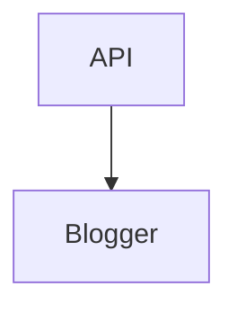

# Hello World
This is a test post generated by the **Blogger Toolchain**.

## Code Block Test
```python
def hello_world():
    print("Hello Blogger API!")
```

## Mermaid Test


## YouTube Test
Check out this video:
{{youtube: dQw4w9WgXcQ}}

## Image Test

